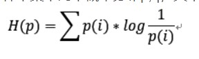

# ADV_NET_CROSS_ENTRYO

 这是交叉熵的正常公式 

#### 在ADVNET中提出直接语义的交叉熵新LOSS
###### 让模型训练能够直接输出高置信度的语义信息
###### 作者提出了两种解决LOSS，方法，直接法和对抗方法

-----
### 单纯的语义交叉熵LOSS
  
###### 语义的交叉熵图，简单来说，就是对得到的语义概率图结果，进行交叉熵得到一张图

  

  
---
1.直接Loss损失就是直接让他们联合最小化  

 
2.对抗的方法，就是让源域和目标域 在这个 Ix的图都很解决

  
##### 通过计算，当有语义预测值很大时，上面的语义交叉熵图的求和值会很小，若如果值差的不多，那么，这个loss就会很大
